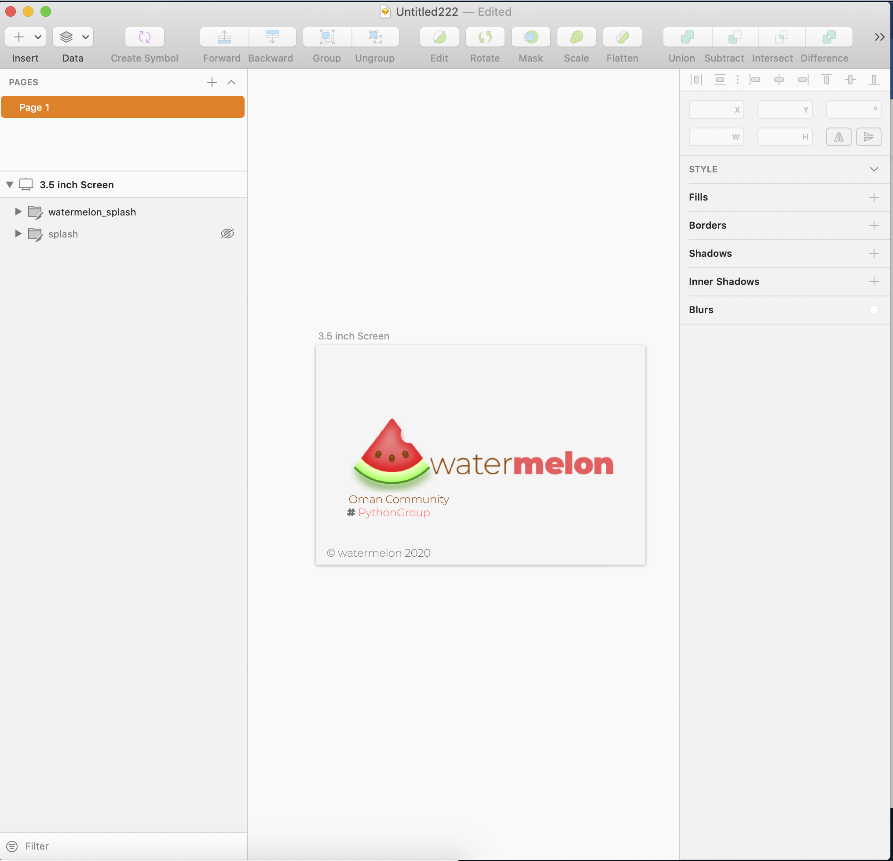
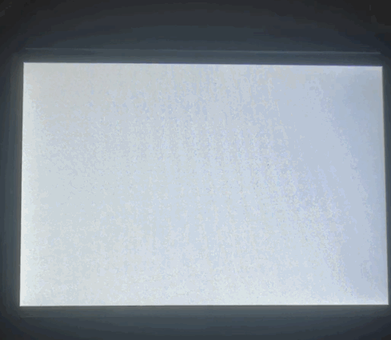

# Introduction :

This project divided into few sections every section contain few steps,
 that will make your pi able to run simple GUI app in python with splash 
 and all other friends.


## Sections:
- [👍🏻]Prepare system .
- [🤚] UI build .
- [🤚] Test code & Real world test .
  

# Section One:
## Prepare system :

- Download raspian lite version .<br/><br/>
https://www.raspberrypi.org/downloads/raspbian/

<br/><br/>

Make sure it is lite version since we want only black console only .

---

After download the respian make sure to mount it using
any application can mount the img .

Next, create wifi config file for auto detect your wifi password
after first boot in case you don't connect your board
to lcd or monitor with hdmi .

To create wifi config file create new file and past the
following information of your router :

```bash
ctrl_interface=DIR=/var/run/wpa_supplicant GROUP=netdev
update_config=1
# in my case I am form oman put your country code
country=OM

network={
 ssid="WIFI NAME"
 psk="WIFI PASSWORD"
}
```
save it as ```wpa_supplicant.conf``` and move the
file into mounted raspian os on your Computer .
Also create file with name ```ssh``` and move it to 
raspian os on your Computer without any extension just ssh .
to <b>enable</b> ```ssh``` .


unmout ```sdcard``` form your comupter and put it in your 
pi and boot the raspberry pi .


to look around for ip of your raspberry pi you can 
use any application to lookup for ip on your router .

or just use router setting to figure out the raspberry pi
local ip .

In my case I will use arp-scan .

```bash
# using  arp-scan with sudo in mac and linux
$ sudo arp-scan --lcoal
# catch up ip and copy it and start use ssh
$ ssh pi@your_local_ip
# password for raspberry pi 
# raspberry
```

after connected to pi using ssh, we will do some simple
configuration around including adding new user and password, change password and 
download few packages .


to create new user:

```bash
$ sudo  nano /etc/apt/sources.list
# and remove hash from last source list 
# deb-src http://raspbian.raspberrypi.org/raspbian/ buster main contrib non-free
$ sudo apt update
$ sudo apt list --upgradeable
$ sudo apt dist-upgrade 
$ sudo adduser python
# add python user to sudo group 
$ sudo adduser python sudo
$ sudo usermod -a -G adm,dialout,cdrom,sudo,audio,video,plugdev,games,users,input,netdev,gpio,i2c,spi python
$ echo 'python ALL=(ALL) NOPASSWD: ALL' | sudo tee /etc/sudoers.d/010_python-nopasswd
$ sudo nano /etc/sudoers.d/010_pi-nopasswd
# outputpi to python
# change 
# pi ALL=(ALL) PASSWD: ALL
# add simple firewall
$ sudo apt install ufw
$ sudo ufw allow 22
$ sudo ufw allow ssh
$ sudo ufw limit ssh/tcp
# change hostname 
$ sudo raspi-config
# form wifi hostname change raspberrypi to salalah-hacker
# finish and reboot system 
```

after second boot i install necessary packages .

```bash
$ sudo apt install python-setuptools libjpeg-dev zlib1g-dev libfreetype6-dev xorg openbox obconf xserver-xorg-video-fbdev python-smbus python3-smbus python-dev python3-dev python3-serial i2c-tools tk-dev python3-tk python3-pip samba samba-common-bin cmake git fbi python3-venv  -y
# change samba server  details & password
$ sudo nano /etc/samba/smb.conf
```

```bash
[salalah-hacker] 
     comment= Salalah Hacker 
     path=/home/python 
     browseable=Yes 
     writeable=Yes 
     only guest=no 
     create mask=0777 
     directory mask=0777 
     public=no
```

```bash
# add password to samba server
$ sudo smbpasswd -a python
# finally add samba role to firewall & restart samba server
$ sudo ufw allow samba
$ sudo ufw reload
$ sudo service smbd restart
```


### Create Splash Screen :

```bash
# install fbi
$ sudo apt install fbi
# create directory where our splash image 
$ cd ~ && mkdir others && cd others && mkdir splash && cd ~
```

after that open any application can manage art with image ```W 480 x H 320```
in my case I will use sketch application .



open new terminal and copy image you just create to raspberry pi :

```bash
$ scp watermelon_splash.png python@192.168.8.135:/home/python/others/splash/
# disable tty
$ sudo systemctl disable getty@tty1
```

Now create new service call it splashservice and paste the following :


first create service file:
```bash
sudo nano /etc/systemd/system/splashscreen.service
```

now copy/paste the following:

```bash

[Unit]
Description=Splash screen
DefaultDependencies=no
After=local-fs.target

[Service]
ExecStart=/usr/bin/fbi -d /dev/fb1 --noverbose -a /home/ayoob/others/splash/splash.png
StandardInput=tty
StandardOutput=tty

[Install]
WantedBy=sysinit.target

```


activate our service :

```bash
$ sudo systemctl enable splashscreen
# test our splash
$ sudo systemctl start splashscreen
```
keep in mind this will display only non animated image so gif will not work and I don't recommand but it can be , but here I will
use non-animated image simple png .
---
# Section Two:
## UI build (UI for our application for above last code can be include here if you want):

So our screen lcd here is 3.5 inch lcd 480 x 320 I buy it from amazon you can also from here .
<br>
https://www.amazon.com/Raspberry-Cooling-Heatsink-320x480-Monitor/dp/B07WRV48ZW
<br>
to make lcd work you should add few things to work properly .
Connect to your raspbery pi then & make sure git already installed then:

```bash
$ git clone https://github.com/goodtft/LCD-show.git
$ chmod -R 755 LCD-show
$ cd LCD-show/
$ sudo ./MHS35-show
```

in case you don't have lcd or monitor with hdmi just do the following :
```bash
$ git clone https://github.com/goodtft/LCD-show.git
$ cd LCD-show
$ sudo cp ./usr/mhs35-overlay.dtb /boot/overlays/
$ sudo cp -rf ./usr/99-calibration.conf-mhs35  /etc/X11/xorg.conf.d/99-calibration.conf
$ sudo cp -rf ./usr/99-fbturbo-fbcp.conf  /usr/share/X11/xorg.conf.d/99-fbturbo.conf
$ sudo git clone https://github.com/tasanakorn/rpi-fbcp
$ sudo mkdir ./rpi-fbcp/build
$ cd ./rpi-fbcp/build/
$ sudo cmake ..
$ sudo make
$ sudo install fbcp /usr/local/bin/fbcp
$ sudo apt-get install xserver-xorg-input-evdev
$ sudo cp -rf /usr/share/X11/xorg.conf.d/10-evdev.conf /usr/share/X11/xorg.conf.d/45-evdev.conf
```


change ```/boot/config.txt``` :

```bash
$ sudo nano /boot/config.txt
```

and copy/past following :
```bash
dtoverlay=mhs35-overlay
hdmi_force_hotplug=1
hdmi_group=2
hdmi_mode=1
hdmi_mode=87
hdmi_cvt 480 320 60 6 0 0 0
hdmi_drive=2
```

change ```/boot/cmdline.txt``` :
```bash
$ sudo nano /boot/cmdline.txt
```

and copy/past following (make sure to add in same line with space only):

```bash
fbcon=map:10 fbcon=font:ProFont6x11 logo.nologo
```

```bash
# fillay reboot your device
$ sudo reboot
```

Now you should be able to see our splash screen .




🤝 you have configure properly your raspian os as we need excpect few
other package and simple configure for next step we will 
go through .


Steps and free materials under MIT License/ others including Application GUI under GPL2 or as compatible License for Qt5 License as it mention what License should be,
This simple project is an open source project for us to learn and for study only .

```bash
MIT License

Copyright (c) 2020 omancommunity

Permission is hereby granted, free of charge, to any person obtaining a copy
of this software and associated documentation files (the "Software"), to deal
in the Software without restriction, including without limitation the rights
to use, copy, modify, merge, publish, distribute, sublicense, and/or sell
copies of the Software, and to permit persons to whom the Software is
furnished to do so, subject to the following conditions:

The above copyright notice and this permission notice shall be included in all
copies or substantial portions of the Software.

THE SOFTWARE IS PROVIDED "AS IS", WITHOUT WARRANTY OF ANY KIND, EXPRESS OR
IMPLIED, INCLUDING BUT NOT LIMITED TO THE WARRANTIES OF MERCHANTABILITY,
FITNESS FOR A PARTICULAR PURPOSE AND NONINFRINGEMENT. IN NO EVENT SHALL THE
AUTHORS OR COPYRIGHT HOLDERS BE LIABLE FOR ANY CLAIM, DAMAGES OR OTHER
LIABILITY, WHETHER IN AN ACTION OF CONTRACT, TORT OR OTHERWISE, ARISING FROM,
OUT OF OR IN CONNECTION WITH THE SOFTWARE OR THE USE OR OTHER DEALINGS IN THE
SOFTWARE.
```
 
 
 


